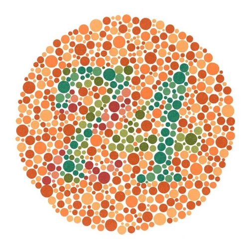
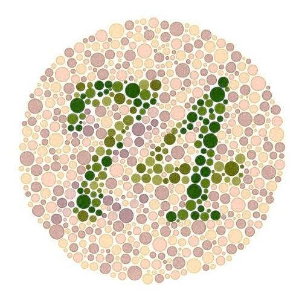
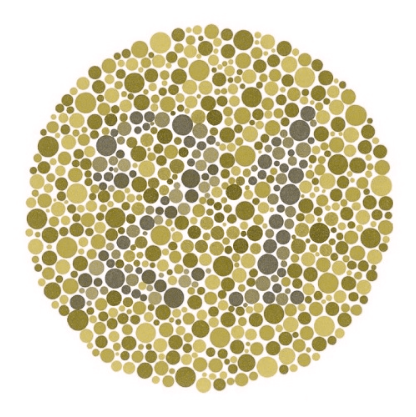
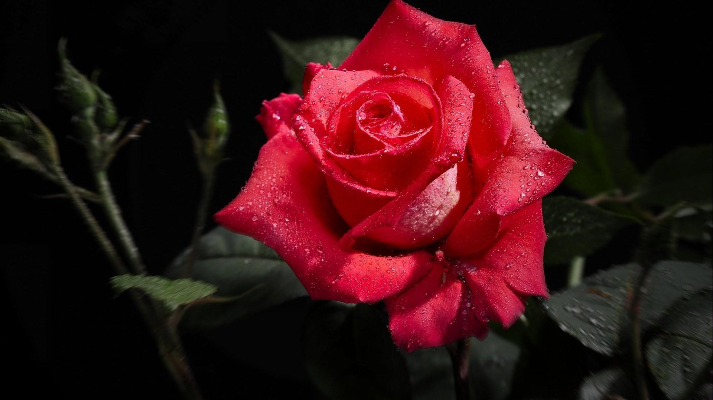
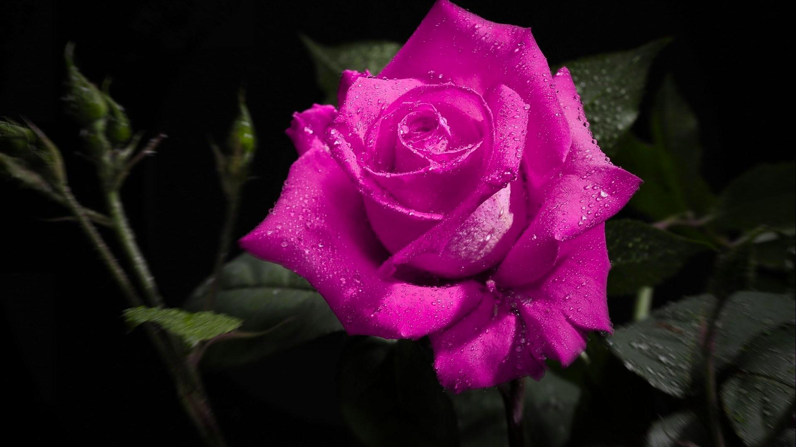
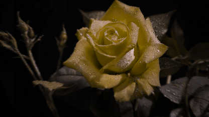
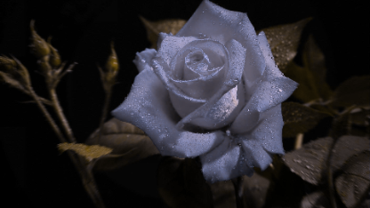

# Daltonize API

[](https://www.python.org/)
[](https://flask.palletsprojects.com/en/stable/)

**Daltonize API** is a public Flask-based service that processes images to generate colorblind-friendly versions. Originally built as the backend for my [See Colors](https://github.com/MelvinDinh3302/seecolors) React Native app, it's open and available for anyone to use.

## Run It on Your Local Machine

### Requirements
- Python 3.x
- curl

### Installation & Usage

1. **Install dependencies**  
   Run the following command to install required Python packages:
   ```bash
   pip install -r requirements.txt
   ```

2. **Start the Flask server**  
   Launch the API locally by running:
   ```bash
   python3 app.py
   ```

3. **Send a request using curl**  
   Use the following command to send an image to the API and receive the daltonized version:
   ```bash
   curl -X POST -F "image=@<input>" -F "type=<type>" http://<your_host_ip>:5000/daltonize --output <output>
   ```
   **Note:** `-F "type=<type>"` is optional. Default = `'d'` for deuteranopia, `'p'` for protanopia, `'t'` for tritanopia.

   **Example:**
   ```bash
   curl -X POST -F "image=@flower.jpg" -F "type=p" http://127.0.0.1:5000/daltonize --output result.jpg
   ```

## Run It Online (Recommended)

### Requirements
- curl

### Usage
Simply replace the local endpoint `http://<your_host_ip>:5000/daltonize` with the hosted API URL `https://daltonize-api.up.railway.app/daltonize`

**Example**
```bash
curl -X POST -F "image=@flower.jpg" -F "type=p" https://daltonize-api.up.railway.app/daltonize --output result.jpg
```

## Demonstration
Ishihara Test (Protanopia/Red-blind)

| Vision Type       | Original Image               | Daltonized Image               |
|-------------------|------------------------------|--------------------------------|
| **Normal Vision** |  |  |
| **Colorblind Vision** |  |  |

Flower (Deuteranopia/Green-blind)

| Vision Type       | Original Image               | Daltonized Image               |
|-------------------|------------------------------|--------------------------------|
| **Normal Vision** |  |  |
| **Colorblind Vision** |  |  |

## Acknowledgments
This API was built upon [Joerg Dietrich's original Daltonize library](https://github.com/joergdietrich/daltonize).