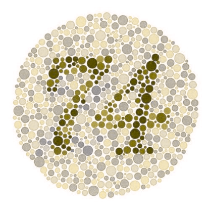

# Daltonize API

This **Daltonize API** processes images to generate colorblind-friendly versions. It takes an input image and returns a modified image that are more visible for colorblind viewers. This API was made to serve as the backend for a future React Native front-end app.

## Run It on Your Own Machine

### Requirements
Python 3.x

### Installation & Usage

1. **Install dependencies**  
   Run the following command to install required Python packages:
   ```bash
   pip install -r requirements.txt
   ```

2. **Start the Flask server**  
   Launch the API locally by running:
   ```bash
   python3 app.py
   ```

3. **Send a request using curl**  
   Use the following command to send an image to the API and receive the daltonized version:
   ```bash
   curl -X POST -F "image=@<input>" -F "type=<type>" http://<your_host_ip>:5000/daltonize --output <output>
   ```
   **Note:** `-F "type=<type>"` is optional. Default = `'d'` for deuteranopia, `'p'` for protanopia, `'t'` for tritanopia.

   **Example:**
   ```bash
   curl -X POST -F "image=@flower.jpg" -F "type=p" http://127.0.0.1:5000/daltonize --output result.jpg
   ```

## Demonstration
Ishihara Test (Protanopia/Red-blind)

| Vision Type       | Original Image               | Daltonized Image               |
|-------------------|------------------------------|--------------------------------|
| **Normal Vision** |  |  |
| **Colorblind Vision** |  |  |

Flower (Deuteranopia/Green-blind)

| Vision Type       | Original Image               | Daltonized Image               |
|-------------------|------------------------------|--------------------------------|
| **Normal Vision** |  |  |
| **Colorblind Vision** |  |  |

## License
This API was built upon [Joerg Dietrich's original Daltonize library](https://github.com/joergdietrich/daltonize).